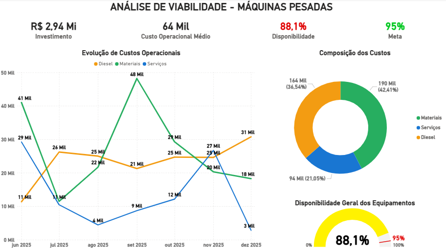
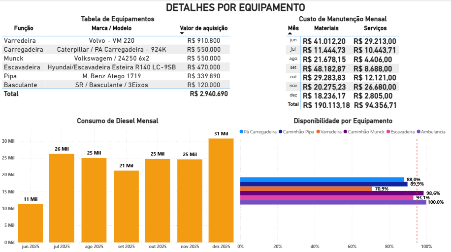
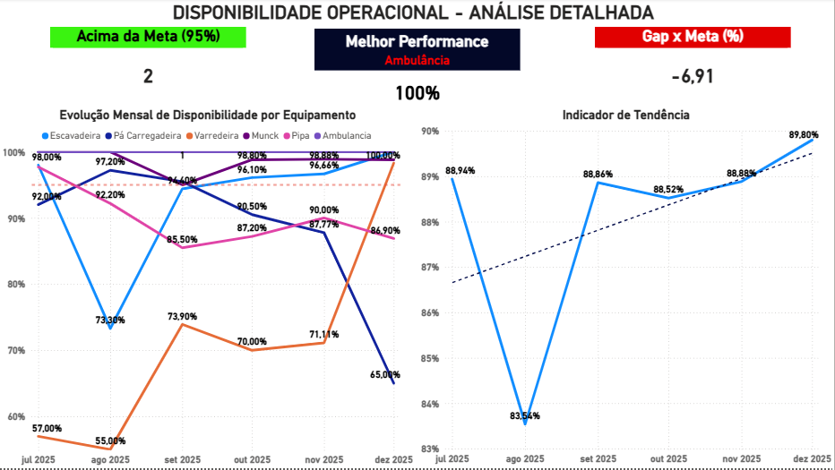
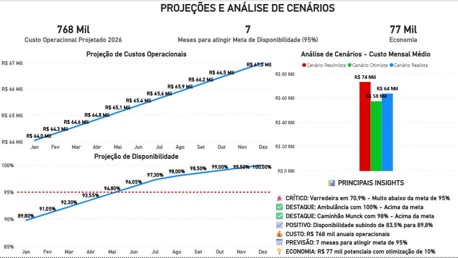

# 📊 Dashboard BI - Análise de Viabilidade de Máquinas Pesadas

> Dashboard interativo em Power BI para análise de investimento de R$ 2,94 milhões em máquinas pesadas

[](https://powerbi.microsoft.com/)
[](https://python.org)
[](https://dax.guide/)

---

## 🎯 Visão Geral

Projeto de Business Intelligence desenvolvido para análise de viabilidade da aquisição de 6 máquinas pesadas em uma usina de mineração, com foco em:

- 💰 **Análise de Custos Operacionais 2025** (R$ 448k em 7 meses)
- 📈 **Monitoramento de Performance** (Meta: 95% de disponibilidade)
- 🔮 **Projeções Financeiras 2026** (R$ 788k projetado com crescimento 5%)
- ⚠️ **Identificação de Equipamentos Críticos** (Varredeira: 70,9%)

---

## 📸 Preview do Dashboard

### Página 1: Visão Executiva


### Página 2: Detalhes por Equipamento


### Página 3: Disponibilidade Operacional


### Página 4: Projeções e Cenários


---

## 🚀 Quick Start

### Pré-requisitos
- Power BI Desktop (versão mais recente)
- Python 3.12+ (opcional, para análises exploratórias)

### Como usar
1. **Clone ou baixe** este repositório
2. **Abra** o arquivo `ProjetoMaquinasPesadasBI.pbix` no Power BI Desktop
3. **Navegue** pelas 4 páginas do dashboard
4. **Explore** os insights e filtros interativos

### Para análise Python
```bash
# Criar ambiente virtual
python -m venv .venv

# Ativar ambiente (Windows)
.venv\Scripts\activate

# Instalar dependências
pip install -r requirements.txt

# Executar análise
python analise_completa.py
```

---

## 📊 Estrutura do Dashboard

### 📄 **Página 1: Visão Executiva**
**KPIs Principais:**
- Investimento Total: R$ 2,94 Mi
- Custo Operacional Médio: R$ 64k/mês
- Disponibilidade Geral: 88,09%
- Meta: 95%

**Visuais:**
- Evolução de Custos (3 categorias: Materiais, Serviços, Diesel)
- Composição dos Custos (Rosca)
- Gauge de Disponibilidade vs Meta

---

### 📄 **Página 2: Detalhes por Equipamento**
**Conteúdo:**
- Tabela completa da frota (6 equipamentos)
- Custos mensais de Manutenção (Matriz detalhada)
- Consumo de Diesel mensal (Gráfico de colunas)
- Disponibilidade individual (Barras com linha de meta)

---

### 📄 **Página 3: Disponibilidade Operacional**
**Análise Detalhada:**
- Cards de Performance (Acima da meta, Gap, Melhor)
- Evolução mensal por equipamento (5 linhas)
- Indicador de Tendência (Crescimento: +6,26%)

**Insights:**
- 2 equipamentos acima da meta (Munck e Pipa)
- Varredeira crítica: 70,9% (necessita atenção)
- Tendência positiva: 83,54% → 89,80%

---

### 📄 **Página 4: Projeções e Cenários**
**Análises Preditivas:**
- Base 2025: R$ 448 mil (Jun-Dez, 7 meses)
- Custo Médio Mensal: R$ 64 mil/mês (base)
- Projeção 2026: R$ 788 mil (12 meses com crescimento 5%)
- Evolução mensal: Jan R$ 64k → Dez R$ 67k
- Meta de disponibilidade: Atingir 95% em 7 meses (Jul/2026)
- Economia potencial: R$ 77 mil/ano

**Cenários Mensais:**
- 🟢 Otimista: R$ 58k/mês (-10%)
- 🔵 Realista: R$ 64-67k/mês (crescimento 5%)
- 🔴 Pessimista: R$ 74k/mês (+15%)

---

## 🔍 Principais Insights

### 🚨 Crítico
- **Varredeira Volvo VM 220** com apenas **70,9%** de disponibilidade
- **24,1% abaixo da meta** → Requer ação imediata

### ✅ Destaque
- **Caminhão Munck** com **98%** de disponibilidade
- **Acima da meta** → Benchmark de excelência

### 📈 Tendência Positiva
- Melhoria de **+6,26%** em 5 meses (ago→dez)
- De 83,54% para 89,80%
- Projeção: atingir 95% em **7 meses**

### 💰 Financeiro
- Custo real 2025 (Jun-Dez): **R$ 448 mil** (7 meses)
- Custo médio mensal: **R$ 64.040/mês**
- Projeção 2026: **R$ 788 mil** (12 meses com crescimento 5%)
- Evolução mensal 2026: Jan R$ 64k → Dez R$ 67k
- Economia potencial: **R$ 77 mil/ano** (com otimização de 10%)

---

## 🛠️ Tecnologias Utilizadas

### Business Intelligence
- **Power BI Desktop** - Desenvolvimento do dashboard
- **DAX (Data Analysis Expressions)** - 15+ medidas calculadas
- **Power Query** - Transformação de dados

### Análise de Dados
- **Python 3.12**
  - Pandas 3.0.0
  - Matplotlib 3.10.8
  - Seaborn 0.13.2
  - OpenPyXL 3.1.5

### Dados
- **Microsoft Excel** - 4 planilhas integradas
- **7 meses** de dados operacionais (Jun-Dez 2025)
- **6 equipamentos** monitorados

---

## 📐 Medidas DAX Principais

```dax
// Custo Operacional Total (Jun-Dez 2025)
Custo_Op_Total = 
    SUM('Custo Manutenção'[Custo Materiais]) + 
    SUM('Custo Manutenção'[Custo Serviços]) + 
    SUM('Custo Diesel'[Custo Total/Mês])

// Custo Médio Mensal (base 2025)
Custo_Op_Medio = DIVIDE([Custo_Op_Total], 7, 0)

// Projeção 2026 com Crescimento 5%
// Tabela Projecao_2026 com valores mensais crescentes
// Jan: R$ 64.040 → Dez: R$ 66.997
// Total anual: R$ 788 mil

// Disponibilidade Geral
Disponibilidade_Geral = 
    DIVIDE(
        AVERAGE(Disponibilidade[Escavadeira]) +
        AVERAGE(Disponibilidade[Pá Carregadeira]) +
        AVERAGE(Disponibilidade[Varredeira]) +
        AVERAGE(Disponibilidade[Caminhão Munck]) +
        AVERAGE(Disponibilidade[Caminhão Pipa 1/2]),
        5
    )

// Gap para Meta
Gap_Meta = ([Disponibilidade_Geral] - 0.95) * 100

// Cenários
Cenario_Otimista = [Custo_Op_Medio] * 0.90
Cenario_Realista = [Custo_Op_Medio]
Cenario_Pessimista = [Custo_Op_Medio] * 1.15
```

---

## 📊 Dados do Projeto

### Equipamentos Analisados
| # | Equipamento | Marca/Modelo | Valor | Disponibilidade |
|---|-------------|--------------|-------|-----------------|
| 1 | Escavadeira | Hyundai R140 LC-9SB | R$ 470.000 | 93,1% |
| 2 | Pá Carregadeira | Caterpillar 924K | R$ 550.000 | 88,0% |
| 3 | Caminhão Munck | Volkswagen 24250 | R$ 550.000 | **98,6%** 🏆 |
| 4 | Varredeira | Volvo VM 220 | R$ 910.800 | **70,9%** ⚠️ |
| 5 | Caminhão Pipa | Mercedes Atego 1719 | R$ 339.890 | 89,9% |
| 6 | Basculante | SR / 3Eixos | R$ 120.000 | - |
| **TOTAL** | | | **R$ 2.940.690** | **88,09%** |

### Composição de Custos (7 meses)
- 🟢 **Materiais:** R$ 190.113 (42,41%)
- 🟠 **Diesel:** R$ 164.000 (36,54%)
- 🔵 **Serviços:** R$ 94.357 (21,05%)
- **TOTAL:** R$ 448.470

---

## 📚 Documentação

- **[PORTFOLIO_PROJETO.md](PORTFOLIO_PROJETO.md)** - Case completo para portfólio
- **[GUIA_POWERBI.md](GUIA_POWERBI.md)** - Guia de implementação detalhado
- **[QUICK_START_30MIN.md](QUICK_START_30MIN.md)** - Tutorial rápido (30 min)
- **[RESUMO_EXECUTIVO.md](RESUMO_EXECUTIVO.md)** - Resumo gerencial
- **[Medidas_DAX_PowerBI.dax](Medidas_DAX_PowerBI.dax)** - Biblioteca de medidas

---

## 🎓 Habilidades Demonstradas

### Técnicas
- ✅ Modelagem de dados relacionais
- ✅ Criação de medidas DAX complexas
- ✅ Visualização de dados avançada
- ✅ Análise exploratória com Python
- ✅ Transformação de dados (Power Query)

### Analíticas
- ✅ Análise de viabilidade financeira
- ✅ KPIs operacionais
- ✅ Projeções e cenários
- ✅ Identificação de tendências
- ✅ Storytelling com dados

### Negócio
- ✅ Gestão de ativos (CapEx)
- ✅ Custos operacionais (OpEx)
- ✅ Análise de ROI
- ✅ Indicadores de manutenção

---

## 💡 Aprendizados

1. **Modelagem de dados é fundamental** - Relacionamentos bem estruturados facilitam análises complexas
2. **DAX é poderoso** - Medidas calculadas permitem análises que SQL puro não alcançaria
3. **Visualização é arte + ciência** - Equilíbrio entre estética e funcionalidade
4. **Contexto de negócio guia decisões técnicas** - Conhecer o domínio é essencial
5. **Iteração melhora o produto** - Feedback contínuo refina o dashboard

---

## 🔗 Contato

**Desenvolvido por:** Diego Bernardes Silva  
**Data:** Fevereiro de 2026  
**Ferramentas:** Power BI Desktop, Python, DAX, Excel  

**Portfolio:** [https://www.dbsolutions.dev.br/]  
**LinkedIn:** [https://www.linkedin.com/in/diegobernardessv/]  
**GitHub:** [(https://github.com/diegobernardessv)]  
**E-mail:** [diegobernardessv@gmail.com]

---

## 📝 Licença

Este projeto foi desenvolvido para fins educacionais e de portfólio.  
Dados sensíveis foram anonimizados/simulados quando necessário.

---

## ⭐ Destaques

- ✨ **4 páginas interativas** e navegáveis
- ✨ **25+ visuais customizados**
- ✨ **15+ medidas DAX**
- ✨ **R$ 2,94 Mi em ativos** analisados
- ✨ **Insights acionáveis** para tomada de decisão

---

**⚡ Dashboard completo demonstrando capacidade em Business Intelligence, desde coleta de dados até entrega de insights estratégicos!**
